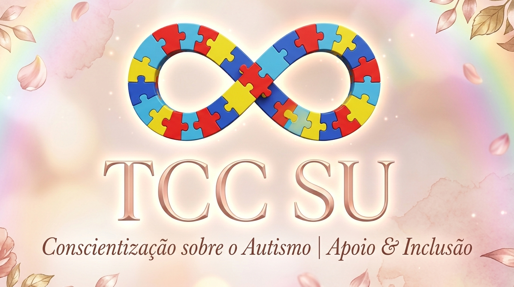

<div align="center">



# 🧩 TCC SU — Plataforma de Blog, Conscientização & Notícias

[](https://nextjs.org/)
[](https://nodejs.org/)
[](https://www.typescriptlang.org/)
[](https://www.prisma.io/)
[](https://tailwindcss.com/)

*Plataforma web no estilo blog e portal de informações sobre o **Transtorno do Espectro Autista (TEA)**, focada em inclusão, conscientização e artigos, desenvolvida especialmente para o Trabalho de Conclusão de Curso (TCC) da integrante **Su**.*

</div>

---

## 📌 Sobre o Projeto

O **TCC SU** é uma aplicação web acolhedora, moderna e responsiva voltada para a publicação e gerenciamento de artigos e notícias sobre a conscientização do autismo. O sistema oferece uma experiência acessível e intuitiva tanto para os leitores quanto para a equipe editorial e administradores.

### 🚀 Funcionalidades Principais

- 📰 **Portal de Notícias**: Leitura de artigos e posts com design limpo, moderno e responsivo.
- 🔐 **Autenticação & Controle de Acesso**: Sistema de login e cadastro seguro de usuários.
- 💬 **Interatividade & Comentários**: Espaço para leitores interagirem e comentarem nos artigos.
- ⚙️ **Painel Administrativo (Dashboard)**: Gerenciamento completo de postagens, categorias, comentários e permissões de usuários.

---

## 🛠️ Tecnologias Utilizadas

### 🎨 Frontend (`Front/`)
- **Framework**: [Next.js 14+](https://nextjs.org/) (App Router) com **TypeScript**
- **Estilização**: [Tailwind CSS](https://tailwindcss.com/) + [`shadcn/ui`](https://ui.shadcn.com/)
- **Ícones**: [Lucide React](https://lucide.dev/)
- **Cliente HTTP & Cache**: [Axios](https://axios-http.com/) + [@tanstack/react-query](https://tanstack.com/query)
- **Formulários & Validação**: `react-hook-form` + `zod` + `@hookform/resolvers`

### ⚙️ Backend (`Back/`)
- **Runtime & Servidor**: [Node.js](https://nodejs.org/) com [Express](https://expressjs.com/) em TypeScript
- **ORM & Banco de Dados**: [Prisma ORM](https://www.prisma.io/) com **SQLite** (`prisma/dev.db`)
- **Autenticação & Segurança**: **Google OAuth** (`google-auth-library`), **JWT** (`jsonwebtoken`) e controle de acesso por cargos (`ADMIN`, `EDITOR`, `USER`)
- **Cache de Memória**: `node-cache`
- **Validação de Dados**: [Zod](https://zod.dev/)

---

## 📂 Estrutura do Repositório

```text
TCC SU/
├── assets/                    # Banners, logos e mídias de documentação
│   └── tcc_su_header.jpg
├── AGENTS.md                  # Mapa central e regras para Agentes de IA
├── agents/                    # Diretrizes operacionais por agente (Git, DB, API, Auth, Mídia)
│   ├── git-commit-agent.md
│   ├── database-agent.md
│   ├── backend-routes-agent.md
│   ├── auth-agent.md
│   └── media-agent.md
├── Front/                     # Aplicação Frontend (Next.js)
└── Back/                      # Aplicação Backend (Express + Prisma)
```

---

## ⚙️ Como Executar o Projeto

### Pré-requisitos
- **Node.js** v18+ instalado
- **npm** ou **yarn**

### 1. Clonar o Repositório
```bash
git clone https://github.com/Archipixel/TCC-SU.git
cd TCC-SU
```

### 2. Configurar o Backend (`Back/`)
```bash
cd Back

# Copie as variáveis de ambiente
cp .env.example .env

# Instale as dependências
npm install

# Execute as migrações do banco de dados (Prisma SQLite)
npx prisma db push

# Inicie o servidor backend em modo de desenvolvimento
npm run dev
```
O servidor backend rodará em `http://localhost:3001`.

### 3. Configurar o Frontend (`Front/`)
Em outro terminal:
```bash
cd Front

# Copie as variáveis de ambiente
cp .env.example .env

# Instale as dependências
npm install

# Inicie a aplicação Next.js
npm run dev
```
A aplicação frontend rodará em `http://localhost:3000`.

---

## 🛡️ Regras de Contribuição (Archipixel Standard)

Este repositório segue rigorosamente o padrão de contribuição detalhado em [`agents/git-commit-agent.md`](agents/git-commit-agent.md):

1. **NUNCA commitar diretamente na branch `main` ou `master`**.
2. **Criar branches isoladas** para qualquer modificação:
   - `feature/nome-da-funcionalidade`
   - `fix/correcao-de-bug`
   - `docs/atualizacao-documentacao`
   - `chore/configuracoes`
3. **Conventional Commits** (em inglês):
   - `feat: add news comment section`
   - `fix: resolve login authentication bug`
   - `docs: update setup instructions in README`

---

## 🔗 Links Úteis

- **Repositório GitHub**: [https://github.com/Archipixel/TCC-SU](https://github.com/Archipixel/TCC-SU)
- **Organização**: [Archipixel](https://github.com/Archipixel)

---

<div align="center">
Desenvolvido com ❤️ pela equipe <b>Archipixel</b> para o TCC da <b>Su</b>.
</div>
